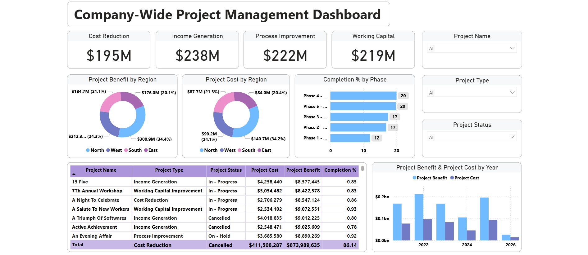

# 🏢 Company-Wide Project Management Dashboard

A Power BI dashboard visualizing company-wide project performance, including key metrics like cost, benefit, project type, region-wise distribution and completion status.

## 📚 About Data

This dataset captures performance metrics for various internal projects across the company. Key attributes include:
- Project Name, Type, and Status
- Cost & Benefit
- Completion % by Phase
- Regional Breakdown (North, South, East, West)

## 💡 Highlights

- East region contributed the most to project benefits and costs, accounting for 34.4% of the total in both categories.
- Total project benefits reached $873.9M, surpassing total project costs of $411.5M, indicating high overall ROI.
- Phase 4 and Phase 5 projects are 100% complete, while Phase 1 lags behind at just 60% completion.
- 2022 recorded the highest project benefit and cost compared to other years.
- Majority of active projects are focused on Income Generation and Working Capital Improvement.

## ✏️ Data Wrangling

- Removed rows with missing values.
- Cleaned and converted Valuation and Funding columns to float.
- Filtered out rows with "Unknown" values in Funding.
- Exploded Select Investors column into individual rows for better categorical analysis.

## 🔍 Purpose 

Designed for company executives and project managers to monitor strategic project performance across departments, regions, and time. Helps identify which project types or regions are generating the most ROI, and track project progress by phase.

## 🧠 Data Storytelling

In 2022, the company saw its highest project investment and returns, with benefits exceeding $0.2B. A closer look shows the East region led in both cost and benefit contributions, making up over a third of total value. However, not all projects are progressing evenly—while Phase 4 and 5 are 100% complete, Phase 1 lags at just 60%, potentially delaying overall ROI. Despite some cancellations, the majority of ongoing efforts are focused on income generation and working capital improvement—highlighting a strategic push toward financial sustainability.

## 📌 Tools Used

- Power BI for data visualization and dashboard creation. [Link](https://app.powerbi.com/view?r=eyJrIjoiODIxYTM1OWItZGIyOS00OWFkLWE5YTEtYzRlMWMwMWQ2ZmM3IiwidCI6ImFjZWQ1ODNlLTRhM2ItNDJkZS05ZTQ0LTRlNWFmYTk5Yjk4YSIsImMiOjEwfQ%3D%3D)

